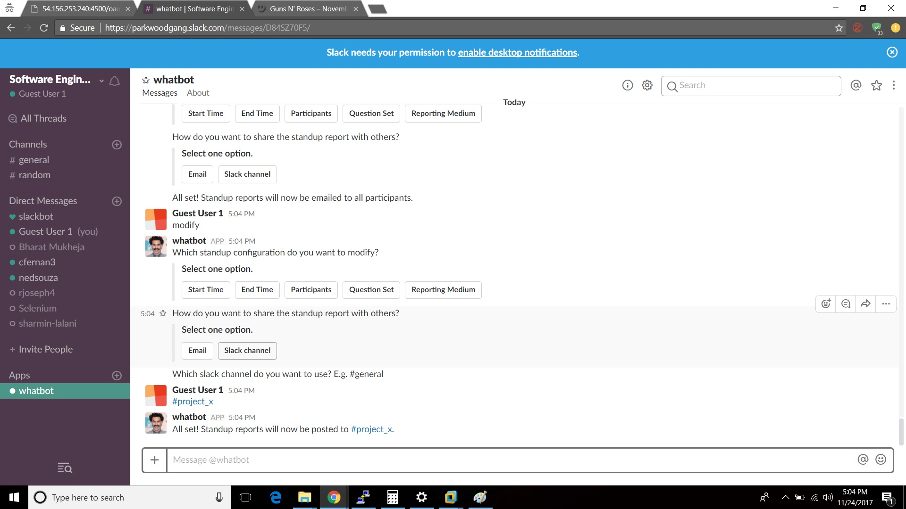

# Deployment

### Environment


### Pre-requisite
* Ubuntu trusty 14.04 Vagrant VM(192.168.33.10) that acts as Configuration Manager
* The Configuration Manager has ansible 2.4.1.0 installed
* AWS account
* 1 elastic Ip address reserved
* The .pem file (required for ssh into EC2) has been chmod 600
* Robot Framework 3.0.2 installed on host machine(in this case windows 10). This is required to automate the bot authorization after the two playbooks have been executed
* Has Selenium2 library imported

### Environment variables
Store the following environment variables in /home/vagrant/.env.
* clientId (present in the slack app credentials page)
* clientSecret (present in the slack app credentials page)
* port (port used for setting up the webserver)

### Steps to enable Google APIs and create client_secret.json
(You can create a separate Google account for the bot for using the Email and spreadsheets functionality, or use an existing account.)
* Use [this wizard](https://console.developers.google.com/flows/enableapi?apiid=sheets.googleapis.com) to create or select a project in the Google Developers Console and automatically turn on the API. Click Continue, then Go to credentials.
* On the Add credentials to your project page, click the Cancel button.
* At the top of the page, select the OAuth consent screen tab. Select an Email address, enter a Product name if not already set, and click the Save button.
* Select the Credentials tab, click the Create credentials button and select OAuth client ID.
* Select the application type Other, enter the name "Google API for whatbot", and click the Create button.
* Click OK to dismiss the resulting dialog.
* Click the file_download (Download JSON) button to the right of the client ID.
* Save this file to the code directory and rename it client_secret.json.
* Use [this wizard](https://console.developers.google.com/flows/enableapi?apiid=gmail.googleapis.com) to select the project created in the first step, and enable the Gmail API.

### Steps to add the bot to the slack team
* Click on "Create a New App to create the Slack App on https://api.slack.com/apps
* Give an App name and select appropriate workspace to be used by the bot.
* Goto the Features tab and Enable Interactive Components:
* Provide the Request URL which contains the public ip of the machine on which the bot would be running. For example, if the bot would be deployed on 54.156.253.240 with port 4500 then the URL would be "http://54.156.253.240:4500/slack/receive".
* Goto the Features tab and click on "OAuth and Permissions":
* Provide the Redirect URL which contains the public ip of the machine on which the bot would be running. For example, if the bot would be deployed on 54.156.253.240 with port 4500 then the URL would be "http://54.156.253.240:4500/oauth".
* On the same page add the below Scopes so that the App has all the required permissions:
 

### Steps to deploy the slack bot onto an EC2 instance
* run **provisionAws.yml** ansible playbook as below
              
             ansible-playbook provisionAws.yml
             
***The provisionAws.yml ansible playbook will check if the EC2 instance with the reserved Elastic IP address exists. If it does, it will terminate the instance and launch a new instance(Ubuntu Trusty 14.04). Attach the resered elastic Ip address to the new EC2 instance and try to do ssh to verify and confirm if the new EC2 instance has been baked successfully.*** 

* run **WhatBot.yml** ansible playbook as below

            ansible-playbook -i inventory WhatBot.yml

***The WhatBot.yml ansible playbook will install all the dependencies and packages required to run WhatBot application onto EC2 instance at port 4500. The inventory file of WhatBot consists of the elastic Ip address of the Ec2 instance and the .pem file.***

* run **BotAuthorization.robot** as below

            pybot BotAuthorization.robot            or
            robot BotAuthorization.robot            or
            Run it directly form PyCharm IDE after having Robot Framework integrated with it

***The BotAuthorization.robot consists of a Selenium test that does authorization of the bot***

### Screencast 

Deploy : https://youtu.be/eG2et5UUcn4 or [Download link](Screencast/WhatBot_Deployment.mp4)


Usecase : https://youtu.be/sc4j_BLjqHs or [Download link](Screencast/WhatBot_UseCaseDemo.mp4)

**********************************************************************************************************************

# User Acceptance Tests
  
##### Use Case 1:

* Login to the slack team and begin the setup  
  
  
  
* Select the time you want the standup to begin
  

  
* Select the time you want the standup to end
  


* Select the users you want to participate in the standup
    


* You can also select a channel


* Select the questions. You can cheeose the default question set or make your own.

 

 Here I made my own questions


  
* Select the reporting method. You can select a slack channel as an option
  


  You can also select Email as a reporting method
  
                 
  
* Once you are done you will see the message as below   
```Awesome! Your standup is configured successfully!```
  

##### Use Case 2:

* Once it time for the standup to begin, the Bot will send a message to each user taking part in the standup


* You can Ignore the standup.

      

* You can also choose to snooze the standup for 10 minutes afer which the bot will send a reminder to complete the standup.

   

* After 10 minutes you will get the buttons again.

   

* You can also start the standup and answer the questions posed by the bot.


* Once done, you can also choose to redo the standup

                 

* If you type ``` No ``` You will get the following screen

     

* If you type ``` yes ``` You will get the questions again. After which you will again be asked the question 'Do you want to redo?'

    

* If you do not complete the report on time you will get the following screen which says 


* Once done with the standup you will get a message from the bot stating the same.


* The reporting will happen at the end time using the configured method. It can be either the slack channel

                

* Or it can be an email.

                 


##### Use Case 3:

* You can see the current standup config by typing ```show config```

                

* To begin Use Case 3, an authenticated user needs to type modify as a direct messade to the bot.


* You can modify the start time by clicking on the ``` Start Time ``` button.


  
* You can modify the start time by clicking on the ``` End Time ``` button.
  


* To modify the list of participants , you need to click on ``` Participants ``` button.


* You can add users you want to participate in the standup
    


* You can remove users you want from the standup
    


* You can modify the standup question set.


* You can modify the reporting method by clicking on the ``` Reporting Medium ``` button. You can select a slack channel as an option
  


* You can also select Email as a reporting method
  
    
  
* Once you are done you will see the message as below   
```Awesome! Your standup is configured successfully!```


##### Pre UseCase Steps:

* Login at http://<IP-adress-where-bot-is-deployed>:<Port-number>/login to authenticate the bot.  

  
  
* Enter your team name and select **continue**  

  
  
* You then need to signin using your credentials
  
  
  
* You then need to click on **Authorize**  
  
  
  
* You will then get the success screen  
  
  

* Login to the slack team [website](https://parkwoodgang.slack.com/).  
  
  
  
* You will see a new message from Whatbot
    

  
* You need to link a google account from which the report email will be sent and to store the standup data. Login to that google account. (The google account used has to be the same as the one used to create the client_secret.json file.)


* You need to allow the Slack bot application to use the google account to send emails and store data in the spreadsheet.


* You will then get a token.


* Copy the token and paste it into slack. If the proper code is entered, you will get a Success message.


* If an incorrect code is entered, you can attempt authorization again ny typing in 'auth'. The 'auth' command can be used anytime to change the Google account used by Whatbot.
